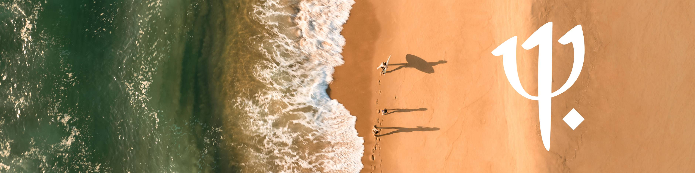

<p align="center">
  
</p>

<p align="center">
  The central knowledge base of the <strong>Club Med AI Guild</strong> —<br/>
  skills, MCP servers, and best practices shared across teams.
</p>

<p align="center">
  <a href="https://github.com/ClubMediterranee/ai-core/stargazers">
    
  </a>
  <a href="https://github.com/ClubMediterranee/ai-core/network/members">
    
  </a>
  <a href="https://github.com/ClubMediterranee/ai-core/commits/main">
    
  </a>
  <a href="https://github.com/ClubMediterranee/ai-core/graphs/contributors">
    
  </a>
  <a href="https://github.com/ClubMediterranee/ai-core/pulls">
    
  </a>
</p>

---

## What's inside

### [Plugins](plugins/README.md) — 7 available

Role-based bundles that install a curated set of skills in one command.

```bash
# Once globally — register the marketplace on your machine
claude plugin marketplace add ClubMediterranee/ai-core

# Per project — install the plugin that matches your stack
claude plugin install clubmed-frontend@clubmed --scope project        # React / Next.js / TypeScript
claude plugin install clubmed-backend-node@clubmed --scope project    # Node.js / API / PostgreSQL
claude plugin install clubmed-backend-python@clubmed --scope project  # Django / FastAPI / Python
claude plugin install clubmed-backend-java@clubmed --scope project    # Java 21+ / Spring Boot
claude plugin install clubmed-infra@clubmed --scope project           # Terraform / Kubernetes / Security
claude plugin install clubmed-data@clubmed --scope project            # GA4 tracking plans / analytics
claude plugin install clubmed-product@clubmed --scope project         # Spec generation / PRD / Product

```

| Plugin | Stack | Skills included |
|--------|-------|-----------------|
| `clubmed-frontend` | React · Next.js · TypeScript · GraphQL | 10 skills |
| `clubmed-backend-node` | Node.js · API · PostgreSQL · Prisma | 11 skills |
| `clubmed-backend-python` | Django · FastAPI · async Python | 11 skills |
| `clubmed-backend-java` | Java 21+ · Spring Boot · API | 9 skills |
| `clubmed-infra` | Terraform · Kubernetes · Container security | 7 skills |
| `clubmed-data` | GA4 tracking plans · analytics · Figma | 3 skills |
| `clubmed-product` | Spec generation · PRD · User stories | 1 skill |

### [Skills](skills/README.md) — 41 available

Individual slash commands that extend Claude Code for specific tasks. Install plugins above to get them pre-bundled, or pick skills individually.

| Category | Skills |
|----------|--------|
| Accessibility | `a11y-audit` · `a11y-web` |
| API | `api-patterns` · `api-security-best-practices` · `graphql` |
| Automation | `agent-browser` |
| Code Quality | `clean-code` |
| Config | `agent-creator` · `skill-creator` |
| Database | `database-migration` · `postgresql-optimization` · `prisma-expert` |
| Design | `excalidraw` · `figma-authentication` · `figma-client` · `trident-icons` · `trident-ui-install` |
| Development | `git-commit` |
| Product | `spec` |
| Project Management | `jira-fetch` |
| Error Handling | `error-handling-patterns` |
| Infrastructure | `container-security-hardening` · `k8s-security-policies` · `terraform-specialist` |
| Java | `java-pro` |
| Node.js | `nodejs-best-practices` |
| Observability | `observability-patterns` |
| Python | `async-python-patterns` · `django-pro` · `fastapi-pro` |
| React / Next.js | `nextjs-best-practices` · `react-best-practices` · `react-component-performance` · `react-patterns` |
| Security | `backend-security-coder` · `security-scanning-security-hardening` · `security-scanning-security-sast` |
| Testing | `e2e-testing` · `testing-patterns` |
| TypeScript | `typescript-advanced-types` · `typescript-expert` |

### [MCP Servers](mcps/README.md) — 5 available

Curated MCP servers to connect Claude to external tools.

| Server | Category |
|--------|----------|
| `context7` | Development |
| `figma` | Design |
| `gtm` | Analytics |
| `playwright` | Testing / Automation |
| `trident-icons` | Design |

---

## Contributors

<a href="https://github.com/ClubMediterranee/ai-core/graphs/contributors">
  
</a>

---

<p align="center">
  <sub>Built with care by the <strong>AI Guild · Club Med</strong> &nbsp;·&nbsp; <a href="https://github.com/ClubMediterranee/ai-core/issues/new">Report an issue</a></sub>
</p>
